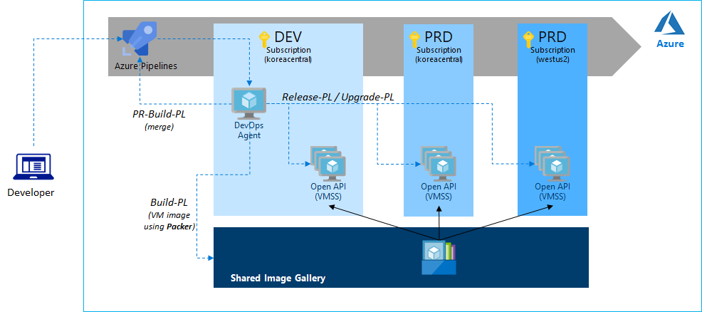

# Sample DevOps CI/CD

## Overview

This sample demonstrates how to create CI/CD pipeline for real-world scenarios and it has following features:

- CI/CD for Windows based application (dotnet core webapi app) to VMSS.
- Sample pipelines for [PR-build](./pipeline/build-pr-pipeline.yml), [build](./pipeline/build-pipeline.yml), [release](./pipeline/release-pipeline-sample.yml) and [upgrade (ssl cert)](./pipeline/upgrade-pipeline-sample.yml).
- Building a VM image using packer.
- Publishing an image to shared image gallery for multi-region and cross subscription deployment.
- Releasing to VMSS with image and installing a certificate and config IIS.
- Upgrading certificate of VMSS without downtime

Please refer [config.md](./config.md) for setup and test this sample.
