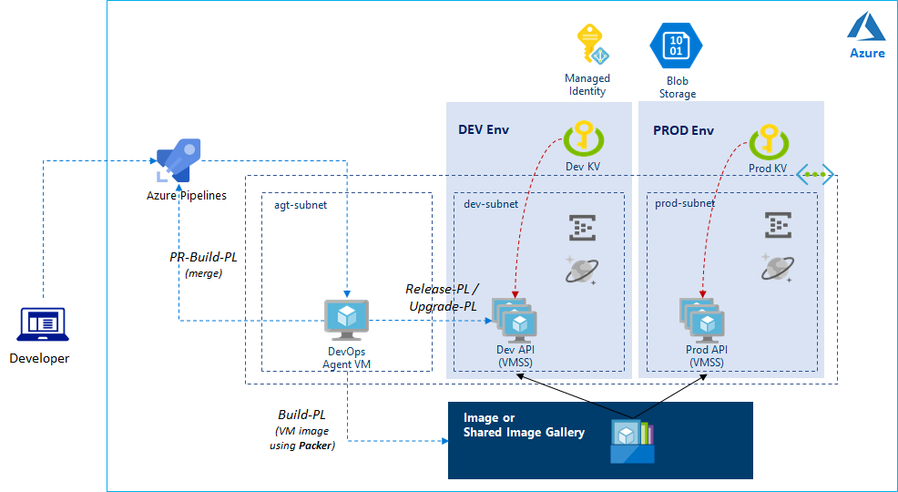

# Setup DevOps Lab using Terraform

> Revised for Terraform _AzureRM 2.1_



## Pre-setup

1. Create a user assigned identity
2. Add this identity in your subscription IAM
3. Update a `variables.tf`

## Run Terraform

> This terraform script will create a _VNET_, _Storage Account_, _Agent VM_ and _Key Vault_.

Run terraform

```
terraform init
terraform apply
```

## Post-setup

1. After run terraform, go to newly created Key Vault.
    - add `adminpassword` __secret__ 
    - add your __certificate__ for VMSS
    - add a self-signed __certificate__ for WinRM access
2. DevOps
    - upload source
    - add key/value of VMSS parameters in __Pipeline/Library/Variables__
    - create an agent pool
    - get a `PAT` for agent VM setup
2. Login to Agent VM,
    - install necessary tools (`dotnet sdk`, `packer`). Please refer [sample install script](./agt/install.ps1)
    - connect `Azure DevOps`
    
> Please refer [documentation](https://docs.microsoft.com/en-us/azure/devops/pipelines/agents/v2-windows?view=azure-devops) for Azure DevOps setup


